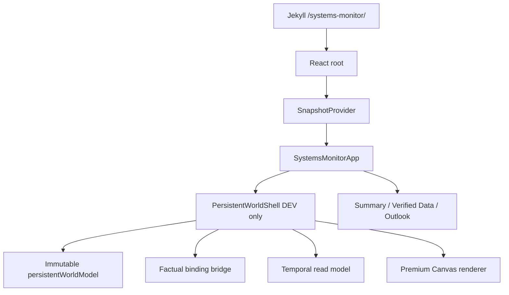

# Current architecture

Jekyll owns `/systems-monitor/` at `auxsays/systems-monitor/index.html`. React mounts at `#systems-monitor-root` from `systems-monitor/app/src/main.tsx`. Vite builds with base `/systems-monitor/` into `systems-monitor/.build/ui`; `compose-jekyll.mjs` copies hashed assets into `auxsays/systems-monitor/assets` and writes the generated include.

`SnapshotProvider` owns validated factual, Phase-4B, and motion review models. `SystemsMonitorApp` routes the three public views (Summary, Verified Data, Outlook), local motion QA, and the DEV-only `#persistent-world` surface. Query routing is canonicalized by `routeSchema.ts`/`useRouteState.ts`.

Local review endpoints are loopback-gated in `vite.config.mjs`. Production must not include persistent-world fixture routes or fixture media.
